# TickETCD - BDNR Project

- [Repository](https://github.com/ines-08/BDNR)
- [Documentation](#documentation)
- [Prototype](#prototype)
    - [Run](#run)
    - [Endpoints](#endpoints)
    - [Credentials](#credentials)
    - [Architecture](#architecture)
    - [Data](#data)
    - [Manual Queries](#manual-queries)
    - [Design](#design)

## Documentation

Beyond this README, more focused on the prototype, the following are available:

- [Milestone 1 Presentation](./docs/Milestone%201/Milestone1.pdf)
- [Milestone 2 Presentation](./docs/Milestone%202/Milestone2.pdf)
- [Milestone 3 Presentation](./docs/Milestone%203/Milestone3.pdf)
- [Demo](./docs/Milestone%203/Demo.mp4)
- [Final Report](./docs/Milestone%203/Report.pdf)

## Prototype

### Run

To instantiate the entire prototype, it is necessary to run the makefile:

```bash
$ cd src/
$ make
```

This process can be time-consuming. Please see the [note](#note). This instruction will:

- Stop and remove previous containers if they exist;
- Remove old versions of the database in `/db` if they exist;
- Create a new infrastructure and containers for the project: a cluster with 5 etcd nodes and one server;
- Create volumes `/db/etcdX` for all existing etcd nodes in the cluster, where X represents the node index;
- Generate data according to the `data/configurations.json` file;
- Populate the cluster with the generated data in parallel.

The server will be available at [localhost:3000](http://localhost:3000/).

If you wish, you can run these commands separately:

```bash
$ make cleanup_containers # Stop and remove previous containers
$ make cleanup_db         # Remove old versions of the database
$ make setup              # Create infrastructure/containers
$ make generate           # Generate data
$ make populate           # Populate the cluster with generated
```

#### Note

The setup step that takes the longest time is the populate step. etcd does not have the capability to receive data in bulk, so each key-value pair must be injected directly into the cluster independently and sequentially. Since the prototype requires many auxiliary structures, only 10 users and 10 events easily scale to around 400 key-value pairs, making the populate process slow.

### Architecture

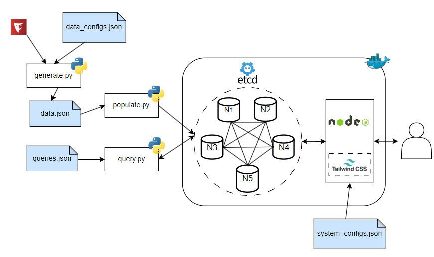

### Credentials

All credentials can be found in the `data.json` file generated during setup. By default, we add two predefined accounts:

- `user / user123` - for a regular user account;
- `admin / admin123` - for an account with administrator privileges.

### Endpoints

- `/`: Used for login or registration;
- `/home[?search=<INPUT>]`: Homepage. By default, it displays some events. If the user searches (using the search field), it shows the search results.
- `/admin`: Admin page displaying database cluster statistics, events, and event creation;
- `/profile?username=<USERNAME>`: Displays details of a user profile, favourite events and last purchases;
- `/notifications`: Displays the current user notifications;
- `/event?id=<ID>`: Displays details of an event;
- `/tickets?eventid=<ID>`: Used for purchasing tickets.

### Data

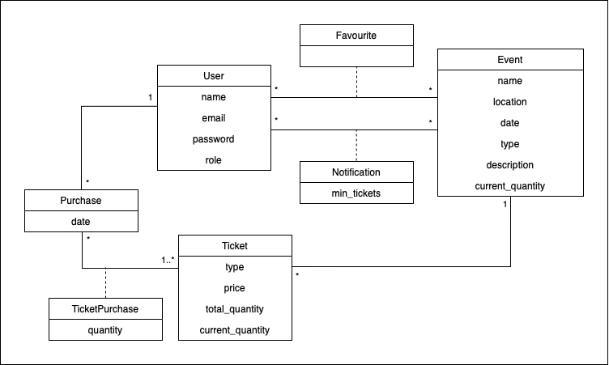

The generated data follows the configurations described in `data/configuration.json`. Parameters example:

```json
{
    "NUM_USERS": 20,
    "NUM_EVENTS": 20,
    "ADMIN_PROBABILITY": 0.1,
    "FAVOURITE_PROBABILITY": 0.3,
    "EVENT_PURCHASE_LIMIT": 3,
    "EVENT_PURCHASE_PROBABILITY": 0.5,
    "TICKET_PURCHASE_PROBABILITY": 0.5,
    "NOTIFICATION_PROBABILITY": 0.3,
    "EVENT_SEARCH_FIELDS": ["name", "description", "location"],
    "EVENT_LOCATIONS": ["London", "Manchester" ],
    "EVENT_TYPES": ["concert", "theater", "dance", "magic", "circus"],
    "TICKET_TYPES": {
      "pink": {"minPrice": 100, "maxPrice": 200, "minQuantity": 10, "maxQuantity": 100},
      "yellow": {"minPrice": 200, "maxPrice": 350, "minQuantity": 80, "maxQuantity": 100},
      "green": {"minPrice": 70, "maxPrice": 80, "minQuantity": 50, "maxQuantity": 500},
      "red": {"minPrice": 50, "maxPrice": 70, "minQuantity": 100, "maxQuantity": 600}
    }
}
```

The currently generated complete aggregates are:

- `User` (username, user, email, password, role);
- `Event` (id, name, description, location, type, date, current_quantity);
- `Ticket` (total_quantity, current_quantity, price).

And the following relations are generated:

- `Favourite` (between a user and events);
- `Search (text, type, location)` (event string indexes);
- `Purchase` (between a user and an event);
- `Notification` (between a user and an event);

For efficiency reasons, the following auxiliary structures are also generated:

- `ticket:types`: possible types for an event;
- `event:types`: possible types for an event;
- `event:locations`: possible locations for an event.

Examples of the formatting of the key-value pairs used in the prototype:

```js
{
    // User
    "user:<USERNAME>": { 
        "name": "user", 
        "email": "user@gmail.com", 
        "password": "user123", 
        "role": "admin"
    },

    // Event
    "event:<ID>": {
        "name": "event", 
        "description": "a simple event", 
        "location": "porto",
        "type": "concert",
        "date": "2024-02-13",
        "current_quantity": "14",
    },

    // Search Events by Text
    "search:text:<WORD>": [
        "EVENT_ID_1",
        "EVENT_ID_2",
    ],

    // Search Events by Type
    "search:type:<TYPE>": [
        "EVENT_ID_3",
        "EVENT_ID_4",
    ],

    // Search Events by Location
    "search:location:<LOCATION>": [
        "EVENT_ID_5",
        "EVENT_ID_6",
    ],

    // Favourite relationship
    "favourite:<USERNAME>": [
        "EVENT_ID_1",
        "EVENT_ID_2",
        "EVENT_ID_3",
    ],

    // Ticket
    "ticket:<EVENT_ID>:<TYPE>": {
        "total_quantity": "34", 
        "current_quantity": "23", 
        "price": "23.30",
    },

    // Purchase
    "purchase:<USERNAME>:<EVENT_ID>": [
        {
            "date": "2024-03-14 13:45:00",
            "tickets": [
                {
                    "type": "red",
                    "quantity": "3",
                },
                {
                    "type": "green",
                    "quantity": "42",
                },
            ]
        },
        {
            "date": "2024-03-16 02:40:00",
            "tickets": [
                {
                    "type": "pink",
                    "quantity": "45",
                },
                {
                    "type": "green",
                    "quantity": "78",
                },
            ]
        },
    ],

    // Notification
    "notification:<USERNAME>:<EVENT_ID>" : {
        "limit": 42,
        "active": true,
    },

    // Static event locations
    "event:locations": ["A", "B", "C"],

    // Static event types
    "event:types": ["D", "E", "F", "G"],

    // Static ticket types
    "ticket:types": ["H", "I", "J"],
}
```

### Manual Queries

There is also the possibility of running some queries externally to the prototype. The queries are described in a data file located at `query/queries.json`:

```json
[
    { 
        "description": "A simple put", 
        "code": "put some thing", 
        "output": false 
    },
    { 
        "description": "Getting all ticket types", 
        "code": "get ticket:types", 
        "output": true 
    }
]
```

We can also choose whether we want to see the output or not, as well as choose a brief description to know what is currently running. Typically in etcd, the output of PUT methods is just OK, so they are ignored.

After the database containers are instantiated and populated, the previous queries can be executed manually using:

```bash
$ make queries
```

Given that etcd does not have any explicit query language, this is the way to perform raw queries using ectd CLI.

### Design

#### Login / register page

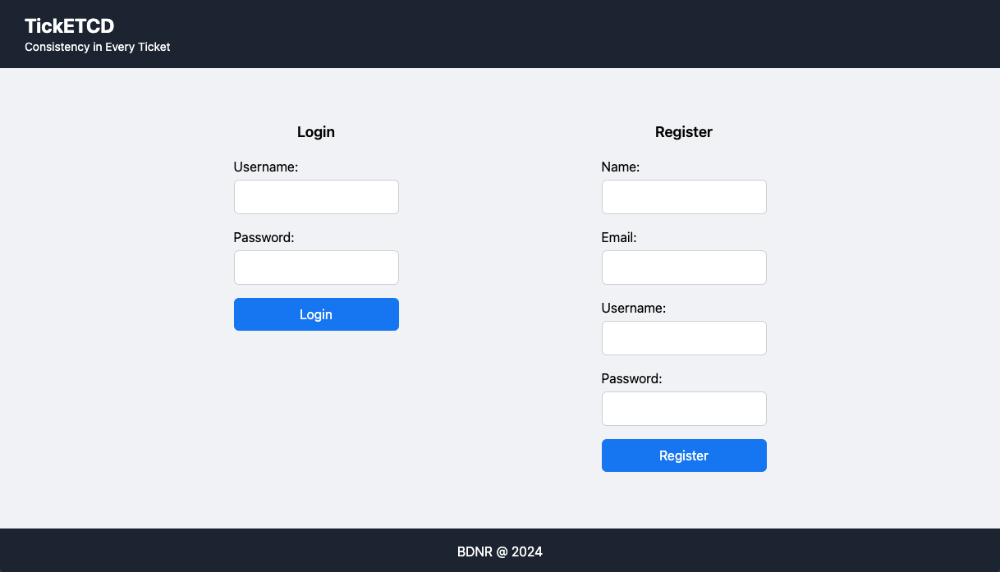

#### Home page

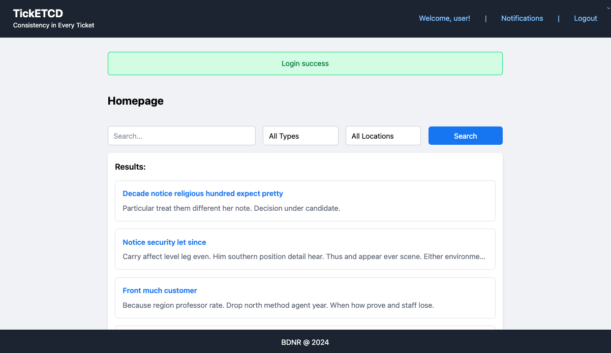

#### Profile page

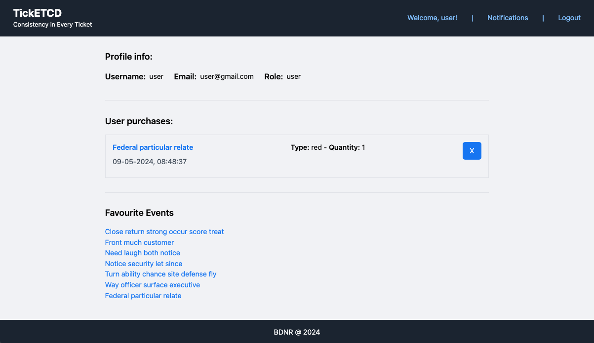

#### Event page

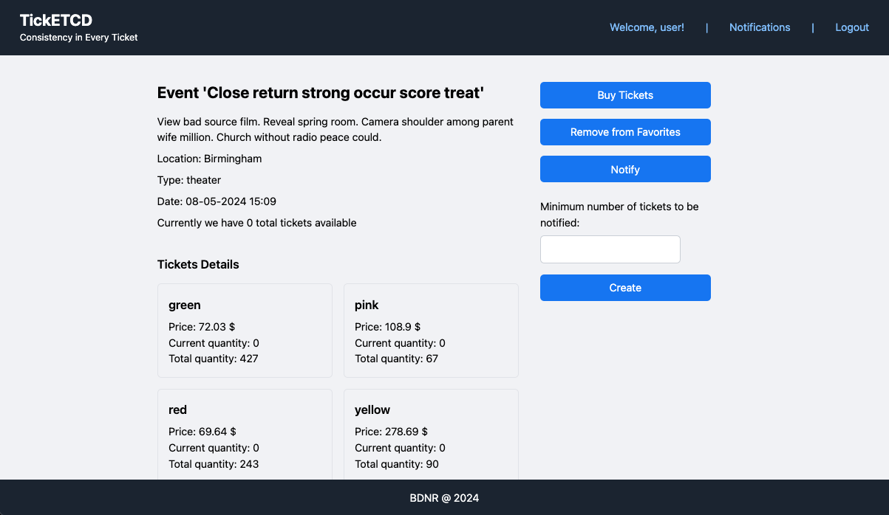

#### Purschase page

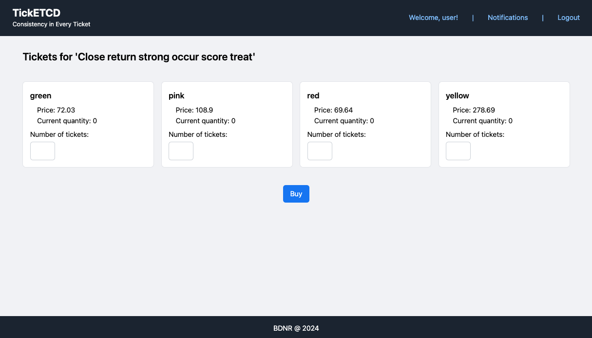

### Notifications page

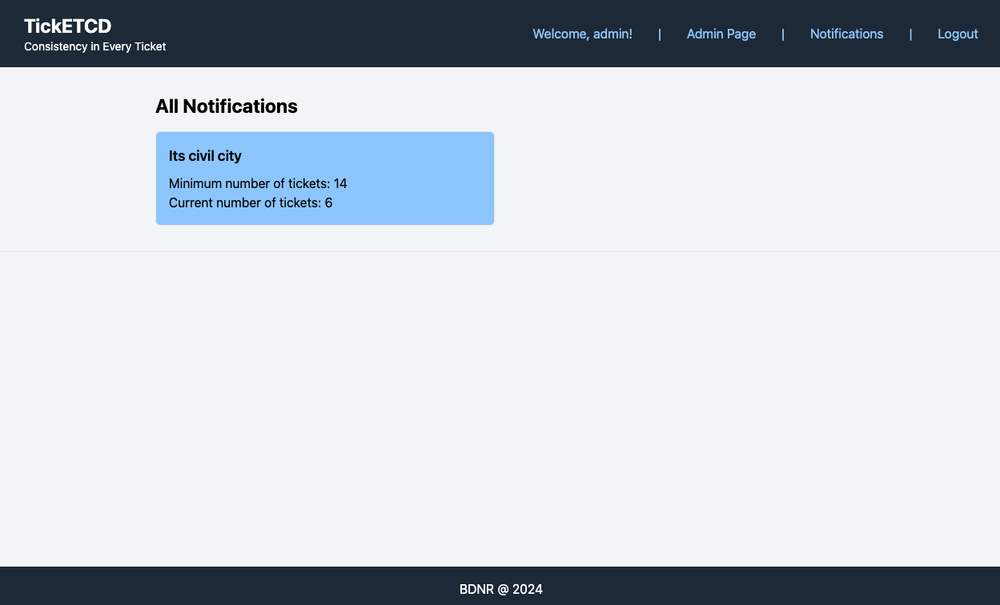

#### Admin - Database info & nodes

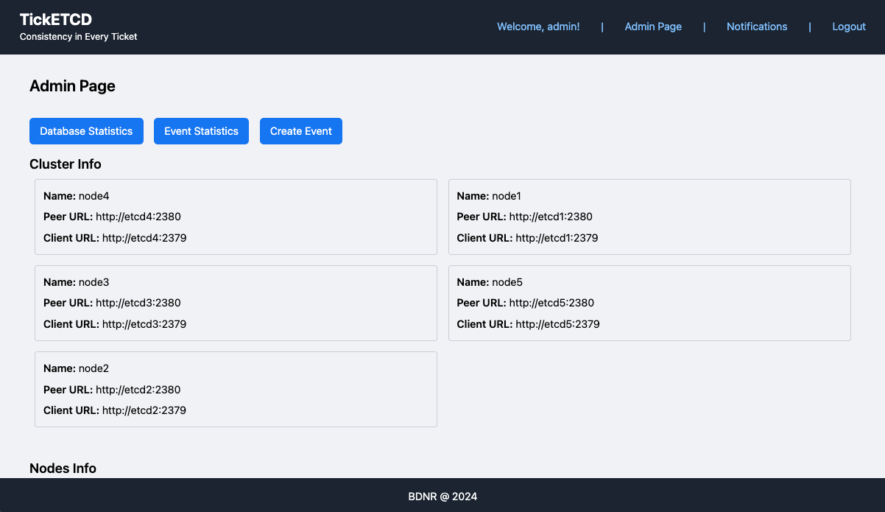
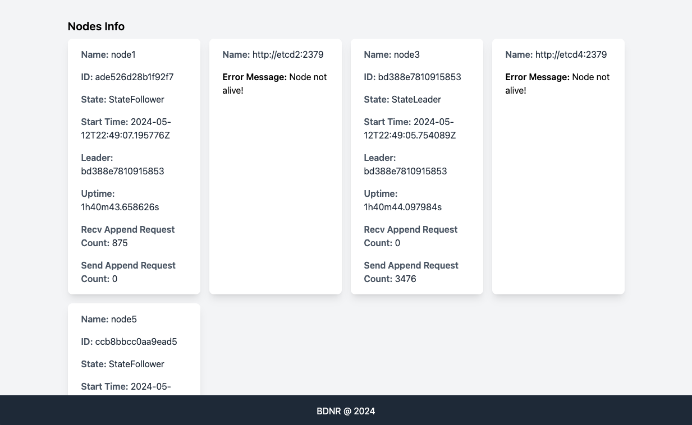

#### Admin - Event statistics

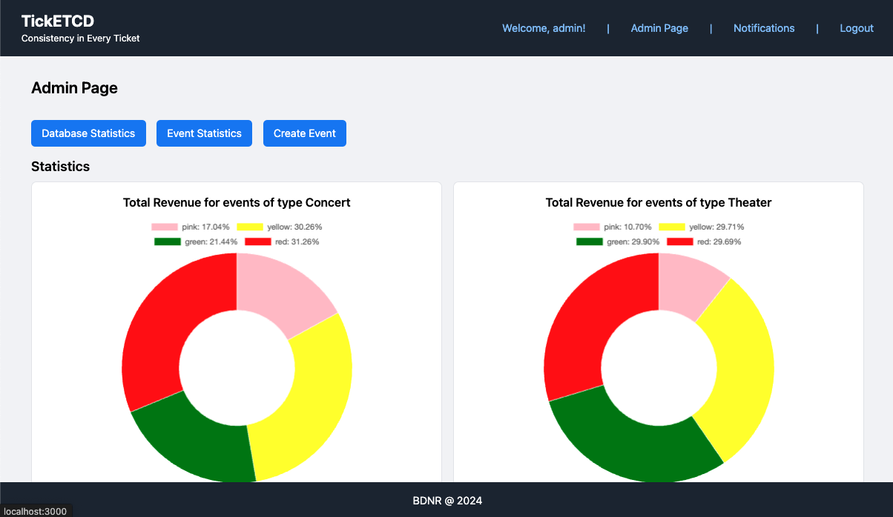

#### Admin - Event creation

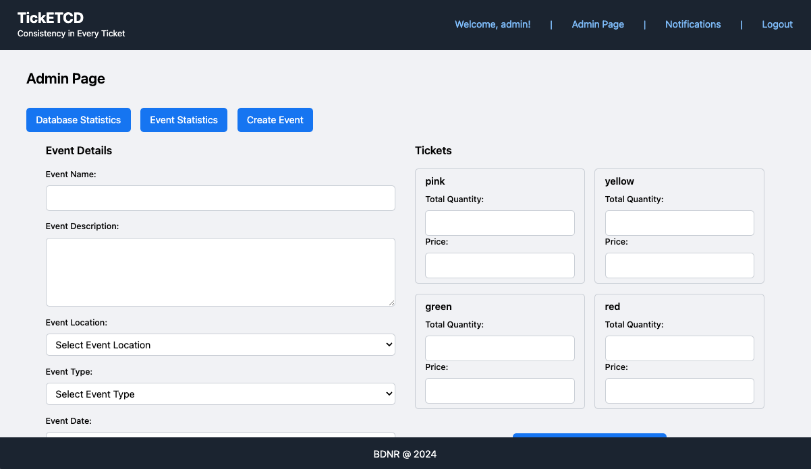

--- 

## Project by:

- Fábio Sá, up202007658@up.pt
- Inês Gaspar, up202007210@up.pt
- José Gaspar, up202008561@up.pt

FEUP, BDNR, 2024